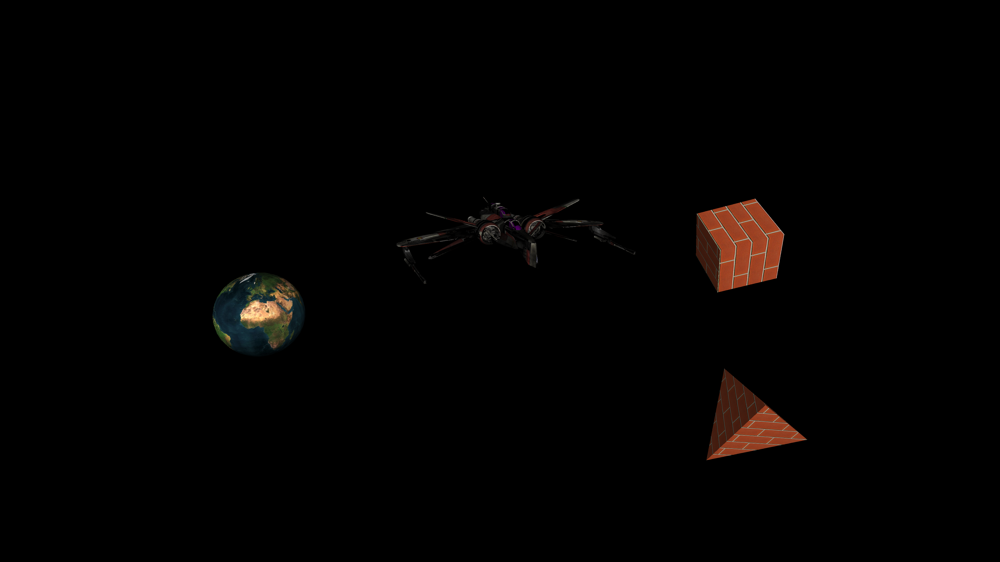

# 3DEngine
A custom 3D rendering engine, written in C++ with OpenGL. Will be steadily adding more features to this over time.

# Example screenshot (as of 14/07/2020)

# Dependencies
There are several libraries that are used in this project, and each can be linked by creating the following environment variables pointing to the library locations:
- **GLEW** - $(GLEW_DIR) - OpenGL Extension Wrangler Library.
- **GLFW** - $(GLFW_DIR) - OpenGL Graphics Library Framework.
- **GLM** - $(GLM_DIR) - OpenGL Mathematics Library.
- **FreeType** - $(FREETYPE_DIR) - FreeType Library - build and link to release version.

# Controls
- **A** - Left
- **D** - Right
- **W** - Forwards
- **S** - Backwards
- **Space** - Up
- **Ctrl** - Down
- **Left arrow** - Turn left
- **Right arrow** - Turn right
- **Up arrow** - Turn up
- **Down arrow** Turn down
- **Mouse** - Look around
- **Esc** - Exit
- **M** - Toggle HUD
- **O / Mouse Scroll Down** - Decrease FOV (zoom in)
- **P / Mouse Scroll Up** - Decrease FOV (zoom out)
